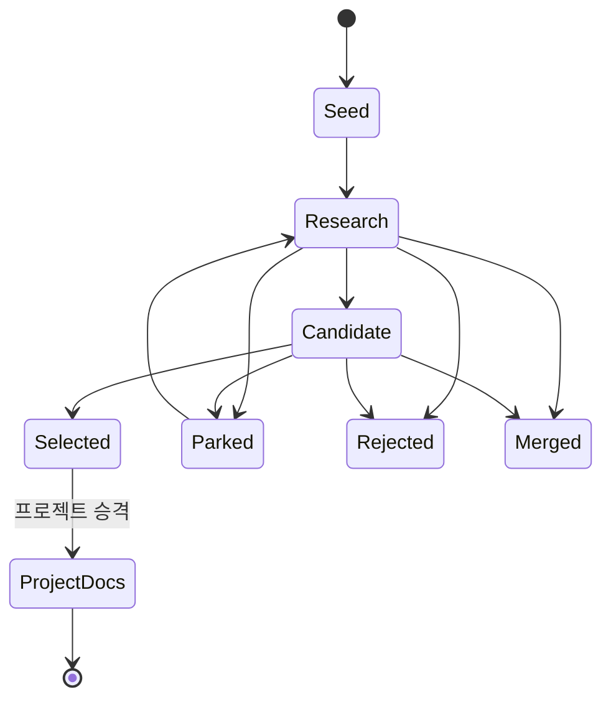

# 워크스페이스 문서 표준

## 목적

이 문서는 이 저장소 루트 아래의 모든 프로젝트에 적용되는 공용 문서 표준을 정의합니다. PRD, 아키텍처 문서, 프롬프트, 발표 자료, 구현 노트를 프로젝트마다 일관된 방식으로 관리하는 것이 목적입니다.

## 문서 배치 기준

프로젝트 문서는 사람이 읽는 진입점과 주제별 세부 문서로 나눠 관리합니다.

- `README.md`는 디렉터리 진입점으로만 사용합니다.
- 주제 문서는 `prd.md`, `architecture.md`, `api.md`처럼 설명적인 Markdown 파일명을 사용합니다.
- 프로젝트 기획, 요구사항, 프롬프트, 아키텍처 노트, 가이드는 각 프로젝트의 `docs/` 아래에 둡니다.
- 문서 운영 규칙은 이 표준과 프로젝트 `docs/README.md`에서 관리하며, 하위 폴더마다 같은 규칙을 반복하는 별도 지침 파일을 두지 않습니다.

## 언어 기준

- 사람용 워크스페이스 문서와 프로젝트 문서는 한국어를 기본으로 작성합니다.
- 코드 식별자, 파일 경로, API 이름, 표준명, 외부 자료 제목은 영어가 더 정확하거나 자연스러우면 영어를 유지합니다.
- 템플릿은 한국어 초안을 만들 수 있어야 하며, PRD, API, ERD, DBML, OpenAPI, Mermaid 같은 일반 기술 라벨은 그대로 사용할 수 있습니다.
- 사용자에게 노출되는 제품 문구는 대상 사용자에게 자연스러운 한국어를 사용합니다.

## 프로젝트 문서

각 프로젝트는 필요에 따라 다음 파일을 둡니다.

| 위치 | 필요 시점 | 역할 |
| --- | --- | --- |
| `README.md` | 필수 | 사람이 읽는 프로젝트 진입점과 문서 인덱스. |
| `docs/README.md` | 필수 | 지원 문서 목록과 상태 관리. |
| `docs/prd.md` | 제품 프로젝트 필수 | 제품 요구사항과 의사결정 기준선. |
| `docs/features.md` | 구현 전 | 핵심 기능과 기능별 요구사항. |
| `docs/architecture.md` | 아키텍처가 필요할 때 | 시스템 결정, 제약, 열린 질문. |
| `docs/backend.md` | 백엔드 구현 전 | 백엔드 모듈, 요청 생명주기, 권한, 잡, 외부 연동, 운영. |
| `docs/data-model.md` | 영속 데이터 구현 전 | ERD, 엔티티, 관계, 보존 정책, 접근 규칙. |
| `docs/api.md` | API 구현 전 | 엔드포인트 계약, 요청/응답 스키마, 에러, 계약 테스트. |
| `docs/prompts-<topic>.md` | AI 프롬프트가 있을 때 | 버전 관리되는 프롬프트와 설계 근거. |
| `docs/archive/<date-topic>.md` | 문서를 교체할 때 | 바로 삭제하지 않을 이전 문서. |

기존 `docs/architecture.md`가 발표 대본처럼 다른 역할로 이미 사용 중이면 구현 아키텍처 문서는 `docs/architecture-notes.md`처럼 충돌하지 않는 설명적 이름을 사용할 수 있습니다. 해당 예외는 프로젝트 `docs/README.md`에 기록합니다.

## 공용 문서

| 위치 | 역할 |
| --- | --- |
| [`decisions.md`](decisions.md) | 저장소 전체에 영향을 주는 구조·운영 합의와 재검토 조건. |
| [`topic-brainstorming.md`](topic-brainstorming.md) | 새 프로젝트 주제 후보, 평가, 보류·배제 이력. |
| [`prd-writing.md`](prd-writing.md) | 공용 PRD 작성법을 개선하는 절차. |
| [`templates/docs.md`](templates/docs.md) | 일반 문서 템플릿. |
| [`templates/topic-brainstorm.md`](templates/topic-brainstorm.md) | 프로젝트 주제 브레인스토밍 템플릿. |
| [`templates/prd.md`](templates/prd.md) | 재사용 가능한 PRD 템플릿. |
| [`templates/feature-spec.md`](templates/feature-spec.md) | 핵심 기능과 기능별 요구사항 템플릿. |
| [`templates/architecture.md`](templates/architecture.md) | 시스템 아키텍처 템플릿. |
| [`templates/backend.md`](templates/backend.md) | 백엔드 아키텍처 템플릿. |
| [`templates/data-model.md`](templates/data-model.md) | 데이터 모델과 ERD 템플릿. |
| [`templates/api.md`](templates/api.md) | API 설계 템플릿. |

## 검증

문서 구조를 바꾼 뒤에는 다음 스크립트를 실행합니다.

```powershell
powershell -ExecutionPolicy Bypass -File scripts/validate-workspace.ps1
```

검증 스크립트는 프로젝트 필수 진입 문서, 프로젝트 인덱스, 프로젝트 루트의 레거시 문서 디렉터리명, 공용 템플릿 경로, 상대 링크, 절대 사용자 경로 포함 여부를 확인합니다. 링크 검사는 Git이 추적하거나 새로 추가된 비무시 Markdown만 대상으로 하며, 저장소 루트는 스크립트 위치를 기준으로 계산합니다.

## 주제 브레인스토밍

새 프로젝트를 만들기 전에는 `topic-brainstorming.md`에서 기존 포트폴리오와 후보를 비교합니다. 일회성 대화에서 끝내지 않고 다음 정보를 문서에 남깁니다.

- 대상 사용자와 반복되는 문제.
- 한 문장 가치 제안과 핵심 사용자 흐름.
- 웹, 모바일, 데스크톱 중 적합한 전달 방식.
- 취업 포트폴리오에서 설명할 수 있는 기술적 증거.
- 데이터 출처, 외부 API, 개인정보, 운영 비용 제약.
- MVP 범위와 가장 위험한 가정의 검증 방법.
- 선택, 보류, 배제, 기존 프로젝트 병합 결정과 그 이유.

후보 문서는 `templates/topic-brainstorm.md`를 사용합니다. 보류·배제된 주제도 삭제하지 않으며 재검토 조건을 기록합니다.

### 상태 전이



- `Seed`: 문제나 관찰만 있으며 아직 평가하지 않은 상태.
- `Research`: 사용자, 대안, 데이터, 전달 방식의 핵심 가정을 조사하는 상태.
- `Candidate`: 비교 가능한 MVP와 위험, 포트폴리오 가치가 정리된 상태.
- `Selected`: 목표 직무, 담당자, 기간, 검증 가정, 프로젝트 slug가 확정된 상태.
- `Parked`: 현재는 선택하지 않지만 재검토 조건이 있는 상태.
- `Rejected`: 현재 문제 정의나 전달 방식으로는 진행하지 않는 상태.
- `Merged`: 기존 프로젝트 기능으로 흡수하기로 한 상태.

### 선택과 프로젝트 승격

`Selected` 후보는 다음 항목을 모두 완료한 뒤 프로젝트 문서로 승격합니다.

1. 브레인스토밍 문서에 선택 이유, 목표 직무, 담당자, 예상 기간, 가장 위험한 가정을 기록합니다.
2. 저장소 루트에 영문 kebab-case 프로젝트 디렉터리를 만듭니다.
3. 프로젝트 `README.md`에 한 줄 설명, 문서 지도, 브레인스토밍 원천 링크를 둡니다.
4. `docs/README.md`에 현재 문서, 상태, 다음 작성 문서를 정리합니다.
5. `docs/prd.md`의 `원천 후보`에 브레인스토밍 문서와 후보 ID를 연결합니다.
6. 브레인스토밍 후보에서도 프로젝트 `README.md` 또는 PRD로 돌아가는 링크를 추가합니다.
7. 루트 `README.md`의 현재 프로젝트 표를 갱신합니다.
8. 검증 스크립트를 실행합니다.

## 문서 연결과 소유권

같은 내용을 여러 문서에 반복하지 않고 다음 문서가 기준 정보를 소유합니다. 하위 문서는 원천 ID나 링크를 참조하고 구현에 필요한 상세만 추가합니다.

| 문서 | 소유하는 정보 | 다음 문서로 넘기는 연결 |
| --- | --- | --- |
| 루트 `README.md` | 워크스페이스 진입점, 현재 프로젝트, 전체 흐름 | 공용 표준, 후보 목록, 프로젝트 README 링크 |
| 루트 `CONTRIBUTING.md` | 기여 진입점과 검증 명령 | 공용 표준과 프로젝트 문서 확인 순서 |
| `decisions.md` | 저장소 공통 구조·운영 결정의 이유와 재검토 조건 | 공용 표준과 검증 규칙 변경 근거 |
| `topic-brainstorming.md` | 후보 ID, 비교, 상태, 선택·보류·배제 근거 | 선택된 프로젝트 경로와 PRD 원천 |
| 프로젝트 `README.md` | 프로젝트 한 줄 맥락과 문서 지도 | 원천 후보, `docs/README.md`, 활성 PRD |
| `docs/README.md` | 프로젝트 문서 인벤토리와 상태 | 활성·향후·해당 없음 문서 |
| `docs/prd.md` | 문제, 사용자, 범위, 제품 요구사항 ID, 성공 기준 | 기능 명세의 `PRD 근거` |
| `docs/features.md` | 기능 ID, 기능 요구사항, 상태, 인수 조건 | 아키텍처·백엔드·데이터·API의 원천 기능 |
| `docs/architecture.md` 또는 프로젝트에 기록된 대체 문서 | 시스템 경계, 구성요소, 런타임 흐름, 기술 결정 | 백엔드·데이터·API의 경계와 제약 |
| `docs/backend.md` | 서버 모듈, 요청 생명주기, 권한, 잡, 운영 | API 동작과 데이터 접근 책임 |
| `docs/data-model.md` | 엔티티, 필드, 관계, 보존, 접근 규칙 | API 스키마와 저장 규칙 |
| `docs/api.md` | 엔드포인트, 요청·응답, 에러, 부수 효과, 계약 테스트 | 구현과 클라이언트 계약 |

추적성 규칙은 새로 작성하거나 하위 구현 문서로 연결하는 요구사항부터 적용합니다. 기존 문서는 형식만 맞추기 위해 일괄 재작성하지 않고, 기능 명세나 설계 문서가 해당 요구사항을 참조해야 할 때 ID를 추가합니다.

- 후보는 `T-001` 형식의 ID를 사용합니다.
- PRD 제품 요구사항은 `PR-001` 형식의 ID를 사용합니다.
- 기능은 `F-001`, 기능 요구사항은 `FR-001`, 비즈니스 규칙은 `BR-001` 형식을 사용합니다.
- 기능 명세의 `PRD 근거`에는 하나 이상의 `PR-*` ID를 적습니다.
- API, 데이터 모델, 백엔드 흐름에는 관련 `F-*` 또는 `FR-*` ID를 적어 변경 영향을 찾을 수 있게 합니다.

## PRD 규칙

- 활성 PRD는 `docs/prd.md`에 둡니다.
- 프로젝트에 이미 호환되는 PRD 형식이 없다면 `_workspace-docs/templates/prd.md`를 사용합니다.
- 기능 목록보다 문제, 근거, 원하는 결과를 먼저 작성합니다.
- 문제 정의는 사용자 인터뷰, VOC, 지원 티켓, 분석 데이터, 시장 조사, 명시된 가정 같은 구체 근거에 기반해야 합니다.
- 프로젝트 간 비교가 가능하도록 주요 섹션을 안정적으로 유지합니다.
- 제품 결정에 영향을 주는 경우에만 프로젝트별 섹션을 추가합니다.
- 템플릿의 모든 섹션을 채우기 위해 내용을 만들지 않습니다. 적용되지 않는 섹션은 짧은 이유와 함께 `해당 없음`으로 표시하거나 프로젝트의 기존 형식에 맞게 생략합니다.
- 불확실성을 숨기지 말고 가정과 열린 질문으로 남깁니다.
- MVP를 넓히기 전에 검증하려는 좁은 사용자 결정이나 업무 흐름을 정의합니다.
- 검증을 흐릴 수 있는 매력적인 확장 기능은 제외 범위로 명시합니다.
- 사용자 경계가 중요한 경우 타깃 사용자와 비타깃 사용자를 모두 적습니다.
- 리뷰어와 구현자가 추측하지 않도록 관찰 가능한 동작, 입력, 출력, 제약, 예시를 사용합니다.
- 위험도가 높거나 사용자에게 직접 노출되는 요구사항에는 인수 조건 또는 검증 기준을 둡니다.
- 보안, 개인정보, 성능, 접근성, 신뢰성, 가용성이 제품 결정이나 구현 범위에 영향을 주면 비기능 요구사항을 작성합니다.
- 실패 상태가 UX, 안전, 개인정보, 구현 범위에 영향을 주면 엣지 케이스와 에러 처리를 작성합니다.
- 추천, 알림, AI 보조 제품은 사용자에게 보이는 결과를 먼저 보여주고 근거는 가까운 곳에 둡니다.
- 과한 알림, 과한 설명, 반복적인 AI 피드백으로 피로를 만들지 않습니다.
- 의미 있는 PRD 변경은 짧은 변경 이력이나 결정 기록으로 추적합니다.
- 구현이 시작된 뒤에는 PRD를 의사결정 기준선으로 취급하고, 운영 상세는 가이드, 런북, 아키텍처 문서로 옮깁니다.
- 큰 개편을 할 때는 기존 PRD를 `docs/archive/YYYY-MM-DD-prd.md`에 보관한 뒤 교체합니다.

## 구현 준비 문서

구현 초안을 만들 수 있을 정도의 세부 설계가 필요할 때는 다음 흐름을 사용합니다.

| 순서 | 프로젝트 문서 | 템플릿 | 목적 |
| --- | --- | --- | --- |
| 1 | `docs/prd.md` | `_workspace-docs/templates/prd.md` | 제품 기준선: 왜, 누구, 범위, 결과, 리스크. |
| 2 | `docs/features.md` | `_workspace-docs/templates/feature-spec.md` | 핵심 기능과 기능별 요구사항. |
| 3 | `docs/architecture.md` | `_workspace-docs/templates/architecture.md` | 시스템 구성요소, 경계, 흐름, 배포 관점, 트레이드오프. |
| 4 | `docs/backend.md` | `_workspace-docs/templates/backend.md` | 백엔드 모듈, 요청 생명주기, 인증/권한, 외부 연동, 잡, 관측성. |
| 5 | `docs/data-model.md` | `_workspace-docs/templates/data-model.md` | ERD, 엔티티, 관계, 접근, 보존, 조회 패턴. |
| 6 | `docs/api.md` | `_workspace-docs/templates/api.md` | 엔드포인트 계약, 스키마, 에러, 부수 효과, 계약 테스트. |

작성 기준:

- PRD에 전체 API 명세, ERD, 백엔드 모듈 상세를 넣지 않습니다.
- `docs/features.md`는 PRD의 MVP 범위와 사용자 흐름에서 시작합니다.
- `docs/architecture.md`는 PRD와 기능 요구사항에서 시작합니다.
- `docs/backend.md`, `docs/data-model.md`, `docs/api.md`는 아키텍처와 기능 요구사항에서 시작합니다.
- 각 구현 준비 문서는 초안 생성에 바로 쓸 수 있어야 합니다. 산문만 길게 쓰기보다 표, 다이어그램, 예시, 열린 질문을 사용합니다.
- 프로젝트에 백엔드, 영속 데이터, API가 없으면 빈 문서를 만들지 말고 `docs/README.md`에 해당 없음으로 표시합니다.
- 복잡한 도구 연동, RAG, MCP, 비용 제어 같은 고급 AI 서비스 설계가 필요한 프로젝트는 `ai-service-blueprint-checklist.md`를 검토한 뒤 해당하는 항목만 관련 문서에 선택적으로 기록합니다.
- 하위 문서는 원천 문서의 문장을 복사하기보다 관련 ID와 링크를 적고 해당 문서가 소유하는 상세만 설명합니다.

## 시각화 표준

시각 자료는 기본적으로 텍스트 기반 다이어그램으로 작성합니다. 그래야 문서와 함께 검색, 리뷰, 버전 관리가 가능합니다.

기본 도구:

| 필요 | 기본값 | 필요 시 보조 |
| --- | --- | --- |
| 제품 또는 기능 흐름 | Mermaid `flowchart` | 외부 와이어프레임 링크 |
| 시간 순서 상호작용 | Mermaid `sequenceDiagram` | 없음 |
| 엔티티 생명주기 또는 UI 상태 | Mermaid `stateDiagram-v2` | 없음 |
| 데이터 모델 또는 작은 ERD | Mermaid `erDiagram` | 스키마가 커지면 DBML |
| API 계약 | Markdown 표 | 구현 단계에서 OpenAPI |
| 발표용 시각 자료 | Mermaid 또는 외부 산출물 링크 | Figma, Excalidraw, 슬라이드 |

규칙:

- 다이어그램은 설명하는 결정이나 흐름 가까이에 둡니다.
- Markdown에서 리뷰할 수 있을 정도로 작게 유지합니다. 큰 다이어그램은 흐름, 모듈, bounded context 단위로 나눕니다.
- 별도 이유가 없다면 canonical 문서에는 Mermaid를 사용합니다.
- 복잡한 관계형 스키마에는 DBML을 보조 산출물로 사용할 수 있지만, canonical 엔티티 요약은 `docs/data-model.md`에 유지합니다.
- 구현 준비가 된 REST API에는 OpenAPI를 보조 산출물로 사용할 수 있지만, 사람이 읽는 엔드포인트 목록은 `docs/api.md`에 유지합니다.
- 다이어그램이 요구사항, 제약, 열린 질문을 대체하게 만들지 않습니다.

권장 시각화:

| 프로젝트 문서 | 권장 시각화 |
| --- | --- |
| `docs/prd.md` | 필요할 때 핵심 사용자 여정 또는 MVP 범위 흐름. |
| `docs/features.md` | P0 기능의 기능 흐름도와 상태 전이도. |
| `docs/architecture.md` | 시스템 컨텍스트, 컴포넌트 경계, 핵심 시퀀스 다이어그램. |
| `docs/backend.md` | 요청 생명주기, 모듈 의존성 그래프, 비동기 잡 흐름. |
| `docs/data-model.md` | ERD와 필요 시 DBML. |
| `docs/api.md` | 엔드포인트 표와 핵심 호출 시퀀스. |

## 제품 기획 원칙

- 하나의 실질적인 사용자 결정이나 할 일을 먼저 잡고, 핵심 흐름이 설득력을 얻은 뒤 확장합니다.
- 문제 정의와 솔루션 설계를 분리합니다. PRD는 구현 세부사항보다 문제와 결과를 먼저 선명하게 만들어야 합니다.
- 원자료 나열보다 행동 가능한 결과를 우선합니다. 데이터를 보여줄 때는 사용자의 다음 행동과 연결합니다.
- 추천 이유는 설명하되 불필요한 개인 맥락을 노출하지 않습니다.
- 위치, 루틴, 문서, 미디어, 알림 설정, 행동 파생 데이터는 기본적으로 민감한 데이터로 취급합니다.
- 개인화는 선택 가능하게 둡니다. 필수 온보딩은 짧게 유지하고 고급 설정은 나중에 제공합니다.
- 범위나 순서를 바꿀 수 있는 가정에는 근거 수준, 위험 수준, 담당자, 검증 경로를 기록합니다.
- 자동화된 결정을 디버깅할 수 있도록 출처, 시각, 규칙 또는 프롬프트 버전, 트리거 신호 같은 메타데이터를 보존합니다.
- MVP, next, future 또는 P0/P1/P2 같은 우선순위 밴드를 명시해 프로토타입 범위가 흐려지지 않게 합니다.

## Markdown 형식 규칙

- 문서마다 하나의 `#` H1만 사용합니다.
- 주요 섹션은 `##`, 하위 섹션은 `###`를 사용하고 heading level을 건너뛰지 않습니다.
- heading 안에 링크를 넣지 않습니다.
- 프로젝트 문서에서는 가능한 한 상대 링크를 사용합니다.
- 링크 텍스트는 한 줄로 유지합니다.
- 목록보다 표가 더 잘 읽히는 인벤토리, 스키마, 계약에는 표를 사용합니다.
- 사용자용 제품 문서는 짧은 문단과 직접적인 한국어를 우선합니다.
- 파일 트리, 스키마, 프롬프트, 다이어그램은 fenced code block을 사용합니다.
- Mermaid 다이어그램은 관계나 흐름을 분명히 할 때만 사용합니다.
- canonical 시각 문서에는 Mermaid를 우선합니다.
- Mermaid나 Markdown 표로 부족해질 때만 DBML 또는 OpenAPI를 보조 구현 산출물로 사용합니다.
- `README.md`는 디렉터리 진입점으로 사용합니다.
- 주제 문서는 `docs/prd.md`, `docs/architecture.md`, `docs/prototype.md`처럼 설명적인 Markdown 파일명을 사용합니다.
- 최상위 `prd/`, `document/`, `documentation/` 디렉터리는 만들지 않습니다.

## 리뷰 체크리스트

문서 변경을 받아들이기 전에 다음을 확인합니다.

- 문서의 목적이 하나로 분명합니다.
- 제목과 heading이 실제 내용과 맞습니다.
- 링크가 가능하면 상대 경로이고 깨지지 않습니다.
- PRD 범위가 MVP, next, future를 구분합니다.
- 범위 확장을 막아야 할 때 제외 범위와 비타깃 사용자가 명시되어 있습니다.
- 성공 지표가 측정 가능하거나 정성 지표임이 표시되어 있습니다.
- 위험도가 높은 요구사항에는 인수 조건 또는 검증 노트가 있습니다.
- UX, 안전, 개인정보, 구현 범위에 영향을 주는 NFR과 엣지 케이스가 있습니다.
- 구현 준비 프로젝트는 해당되는 경우 feature, architecture, backend, data-model, API 문서를 갖춥니다.
- 기능 요구사항이 PRD의 MVP 범위와 연결됩니다.
- API 필드와 데이터 모델 필드가 서로 맞습니다.
- 열린 질문이 명시되어 있습니다.
- 중요한 가정에는 근거 또는 검증 계획이 있습니다.
- 사용자 데이터를 다루면 민감 데이터 처리 기준이 문서화되어 있습니다.
- 다른 문서를 중복하지 않고 필요하면 링크합니다.
- 저장소 내부 문서에 특정 사용자의 절대 파일 경로가 없습니다.
- `Selected` 후보와 생성된 프로젝트 문서가 서로 링크됩니다.
- 기능 명세의 `PRD 근거`가 실제 `PR-*` 요구사항을 가리킵니다.
- 아키텍처, 백엔드, 데이터 모델, API 문서의 원천 기능 ID가 실제 기능 명세에 존재합니다.
- 기존 지침을 대체하는 경우 이전 문서를 보관하거나 명확히 superseded 처리합니다.
- 프로젝트와 docs 디렉터리에 `README.md` 진입점이 있습니다.

## 출처

- GitHub Docs, About READMEs: https://docs.github.com/en/repositories/managing-your-repositorys-settings-and-features/customizing-your-repository/about-readmes
- Google Developer Documentation Style Guide: https://developers.google.com/style/
- Google Developer Documentation Style Guide, Headings and titles: https://developers.google.cn/style/headings
- Nix documentation framework summary of Diataxis: https://nix.dev/contributing/documentation/diataxis
- CommonMark Specification: https://spec.commonmark.org/spec
- Google Documentation Best Practices: https://google.github.io/styleguide/docguide/best_practices.html
