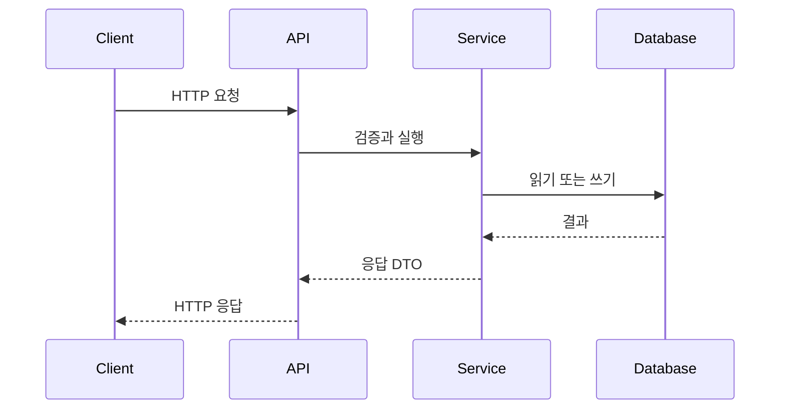

# [프로젝트명] API 설계

## 0. 문서 메타데이터

| 항목 | 값 |
| --- | --- |
| 상태 | Draft \| Review \| Active \| Superseded |
| 담당자 | |
| 마지막 업데이트 | |
| 원천 문서 | `docs/features.md`, `docs/backend.md`, `docs/data-model.md` |
| 원천 기능 | `F-001`, `FR-001` |
| 관련 문서 | `docs/prd.md`, `docs/architecture.md` |

## 1. 목적

클라이언트, 백엔드 모듈, 외부 소비자 사이의 API 계약을 정의합니다.

이 문서는 route handler, 클라이언트 호출, 검증 스키마, 계약 테스트를 만들 수 있을 정도로 구체적이어야 합니다.

## 2. API 원칙

| 원칙 | 규칙 |
| --- | --- |
| 버전 관리 | |
| 인증 | |
| 권한 | |
| 멱등성 | |
| 페이지네이션 | |
| 에러 형식 | |
| 레이트 리밋 | |

## 3. 공통 요청 규칙

| 영역 | 표준 |
| --- | --- |
| 기본 경로 | `/api` |
| Content type | `application/json` |
| 인증 헤더 | |
| 날짜 형식 | ISO 8601 |
| ID | |
| 페이지네이션 파라미터 | |

## 4. 공통 응답 형태

### 성공

```json
{
  "data": {},
  "meta": {}
}
```

### 에러

```json
{
  "error": {
    "code": "ERROR_CODE",
    "message": "사용자 또는 개발자가 이해할 수 있는 메시지",
    "details": {}
  }
}
```

## 5. 엔드포인트 목록

| Method | Path | 목적 | 인증 | 우선순위 | Handler 또는 모듈 |
| --- | --- | --- | --- | --- | --- |
| GET | `/api/example` | | Required \| Optional \| None | P0 | |

여러 모듈을 지나는 핵심 호출에는 시퀀스 다이어그램을 사용합니다.



## 6. 엔드포인트 상세

엔드포인트마다 이 섹션을 반복합니다.

### GET /api/example

#### 목적

이 엔드포인트가 하는 일과 사용하는 기능을 설명합니다.

#### 인증과 권한

| 요구사항 | 값 |
| --- | --- |
| 인증 | Required \| Optional \| None |
| 권한 | |
| 레이트 리밋 | |

#### 요청

##### Path Params

| 이름 | 타입 | 필수 | 비고 |
| --- | --- | --- | --- |
| | | | |

##### Query Params

| 이름 | 타입 | 필수 | 기본값 | 검증 |
| --- | --- | --- | --- | --- |
| | | | | |

##### Body

```json
{}
```

#### 응답

##### 200 OK

```json
{
  "data": {}
}
```

#### 에러

| Status | Code | 발생 조건 | 클라이언트 복구 방법 |
| --- | --- | --- | --- |
| 400 | VALIDATION_ERROR | | |
| 401 | UNAUTHORIZED | | |
| 403 | FORBIDDEN | | |
| 404 | NOT_FOUND | | |
| 409 | CONFLICT | | |
| 429 | RATE_LIMITED | | |
| 500 | INTERNAL_ERROR | | |

#### 부수 효과

| 부수 효과 | 트리거 | 비고 |
| --- | --- | --- |
| | | |

#### 계약 테스트

| 케이스 | 요청 | 기대 응답 |
| --- | --- | --- |
| 성공 | | |
| 검증 에러 | | |
| 권한 없음 | | |

## 7. 웹훅 또는 외부 API

| 방향 | 제공자 | 엔드포인트 또는 이벤트 | 목적 | 보안 |
| --- | --- | --- | --- | --- |
| Incoming \| Outgoing | | | | |

## 8. 선택적 OpenAPI 초안

API가 구현 또는 계약 테스트 단계에 가까워졌을 때만 사용합니다.

```yaml
openapi: 3.1.0
info:
  title: [프로젝트명] API
  version: 0.1.0
paths:
  /api/example:
    get:
      summary: 예시 엔드포인트
      responses:
        "200":
          description: OK
```

## 9. 열린 질문

| 질문 | 담당자 | 필요 시점 | 미해결 시 영향 |
| --- | --- | --- | --- |
| | | | |

## 10. 초안 완료 체크리스트

- 엔드포인트 목록이 모든 P0 기능을 포함한다.
- 각 엔드포인트에 인증, 요청, 응답, 에러, 부수 효과가 있다.
- 에러 형식이 일관적이다.
- 성공과 주요 실패 케이스에 대한 계약 테스트가 있다.
- API 필드가 `docs/data-model.md`와 맞는다.
