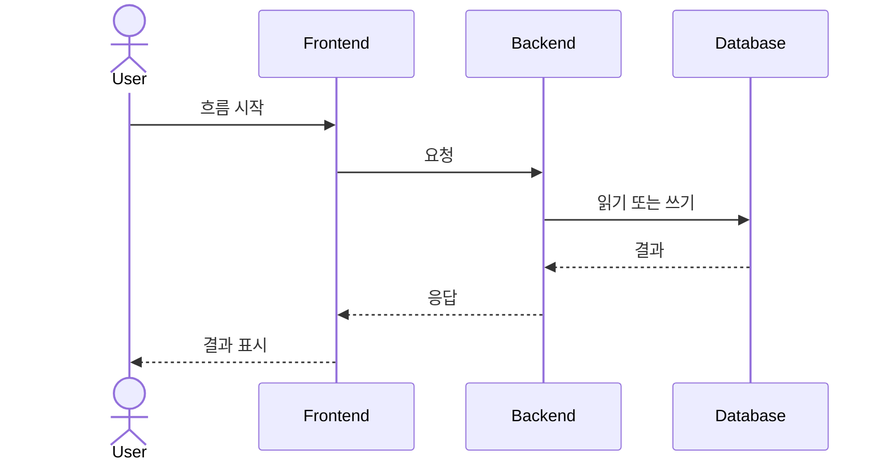

# [프로젝트명] 시스템 아키텍처

## 0. 문서 메타데이터

| 항목 | 값 |
| --- | --- |
| 상태 | Draft \| Review \| Active \| Superseded |
| 담당자 | |
| 마지막 업데이트 | |
| 원천 PRD | `docs/prd.md` |
| 원천 기능 | `F-001`, `F-002` |
| 관련 문서 | `docs/features.md`, `docs/backend.md`, `docs/data-model.md`, `docs/api.md` |

## 1. 목적

구현 전에 필요한 시스템 형태, 주요 구성요소, 경계, 런타임 흐름, 아키텍처 결정을 설명합니다.

이 문서는 기술 선택을 다루되, 엔드포인트별 명세나 테이블별 상세까지 내려가지는 않습니다.

## 2. 아키텍처 목표

| 목표 | 중요한 이유 | 우선순위 |
| --- | --- | --- |
| | | |

## 3. 컨텍스트

이 시스템이 사용자, 외부 서비스, 내부 시스템, 운영 제약과 어떤 관계를 갖는지 설명합니다.

## 4. 시스템 구성요소

| 구성요소 | 책임 | 담당 | 런타임 | 비고 |
| --- | --- | --- | --- | --- |
| 웹 앱 | | | | |
| 백엔드 | | | | |
| 데이터베이스 | | | | |
| 외부 서비스 | | | | |

## 5. 구성요소 경계

| 경계 | 허용 방향 | 전달 데이터 | 이유 |
| --- | --- | --- | --- |
| 프론트엔드 -> 백엔드 | | | |
| 백엔드 -> 데이터베이스 | | | |
| 백엔드 -> 외부 서비스 | | | |

## 6. 주요 런타임 흐름

중요한 흐름마다 반복합니다.

### 흐름 1. [흐름명]

1. 행위자 시작:
2. 프론트엔드 전송:
3. 백엔드 검증:
4. 백엔드 읽기/쓰기:
5. 외부 서비스 호출:
6. 응답 반환:
7. 실패 동작:

## 7. 배포 관점

| 런타임 또는 서비스 | 환경 | 책임 | 확장 고려사항 |
| --- | --- | --- | --- |
| | Local \| Dev \| Staging \| Prod | | |

## 8. 교차 관심사

| 관심사 | 설계 결정 | 관련 문서 |
| --- | --- | --- |
| 인증 | | `docs/backend.md` |
| 권한 | | `docs/backend.md` |
| 데이터 영속성 | | `docs/data-model.md` |
| API 계약 | | `docs/api.md` |
| 관측성 | | |
| 백그라운드 작업 | | |
| 파일 또는 미디어 처리 | | |

## 9. 아키텍처 결정

| 결정 | 검토한 대안 | 선택한 안 | 이유 | 재검토 시점 |
| --- | --- | --- | --- | --- |
| | | | | |

## 10. 리스크와 트레이드오프

| 리스크 또는 트레이드오프 | 영향 | 완화 방법 |
| --- | --- | --- |
| | | |

## 11. 열린 질문

| 질문 | 담당자 | 필요 시점 | 미해결 시 영향 |
| --- | --- | --- | --- |
| | | | |

## 12. 초안 완료 체크리스트

- 주요 구성요소와 책임이 분명하다.
- 구성요소 경계와 허용 데이터 흐름이 명시되어 있다.
- 핵심 런타임 흐름이 설명되어 있다.
- 아키텍처 결정에 대안과 근거가 있다.
- 백엔드, API, 데이터 모델 상세는 각 전용 문서로 위임되어 있다.
