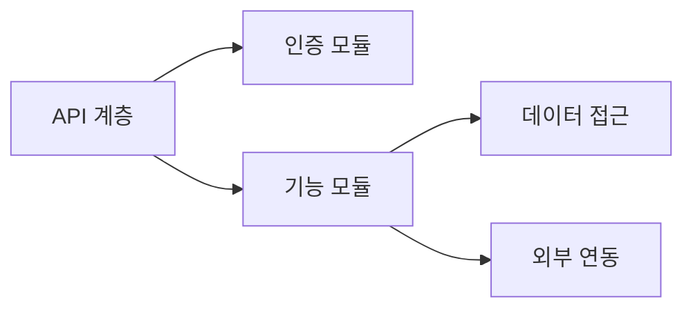
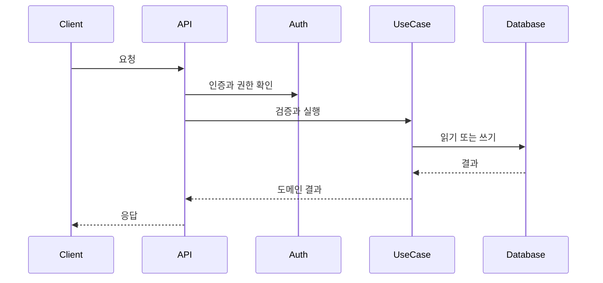
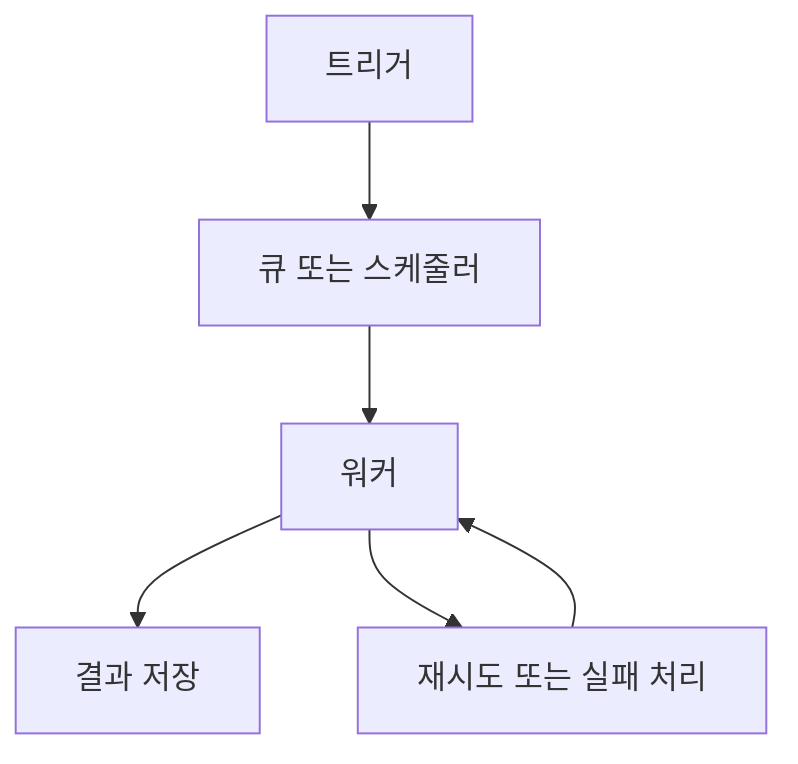

# [프로젝트명] 백엔드 아키텍처

## 0. 문서 메타데이터

| 항목 | 값 |
| --- | --- |
| 상태 | Draft \| Review \| Active \| Superseded |
| 담당자 | |
| 마지막 업데이트 | |
| 원천 문서 | `docs/prd.md`, `docs/features.md`, `docs/architecture.md` |
| 원천 기능 | `F-001`, `FR-001` |
| 관련 문서 | `docs/api.md`, `docs/data-model.md` |

## 1. 목적

백엔드 책임, 모듈 경계, 요청 처리, 권한, 외부 연동, 잡, 운영 동작을 정의합니다.

## 2. 백엔드 범위

| 포함 범위 | 제외 범위 | 이유 |
| --- | --- | --- |
| | | |

## 3. 런타임과 스택

| 계층 | 선택 | 이유 | 재검토 시점 |
| --- | --- | --- | --- |
| 런타임 | | | |
| 프레임워크 | | | |
| 데이터베이스 접근 | | | |
| 인증 | | | |
| 검증 | | | |
| 백그라운드 잡 | | | |

## 4. 백엔드 모듈

| 모듈 | 책임 | 의존 대상 | 소유 데이터 | 노출 인터페이스 |
| --- | --- | --- | --- | --- |
| | | | | |

## 5. 요청 생명주기

일반적인 요청 처리 경로를 설명합니다.

1. 요청 수신:
2. 인증:
3. 권한 확인:
4. 입력 검증:
5. 유스케이스 실행:
6. 데이터 읽기/쓰기:
7. 외부 서비스 호출:
8. 응답 반환:
9. 로그 또는 이벤트 기록:

## 6. 인증과 권한

| 행위자 또는 역할 | 인증 방식 | 권한 | 비고 |
| --- | --- | --- | --- |
| | | | |

## 7. 검증과 에러 전략

| 영역 | 전략 | 에러 형태 | 비고 |
| --- | --- | --- | --- |
| 요청 본문 | | | |
| 쿼리 파라미터 | | | |
| 도메인 규칙 | | | |
| 외부 실패 | | | |

## 8. 외부 연동

| 연동 | 목적 | 보내는 데이터 | 받는 데이터 | 실패 동작 |
| --- | --- | --- | --- | --- |
| | | | | |

## 9. 백그라운드 잡 또는 비동기 작업

| 잡 | 트리거 | 입력 | 멱등성 규칙 | 재시도 규칙 |
| --- | --- | --- | --- | --- |
| | | | | |

## 10. 파일, 미디어, 대용량 페이로드 처리

| 페이로드 유형 | 저장 위치 | 처리 방식 | 보존 기간 | 보안 비고 |
| --- | --- | --- | --- | --- |
| | | | | |

## 11. 관측성

| 신호 | 수집할 내용 | 민감 데이터 규칙 |
| --- | --- | --- |
| 로그 | | |
| 메트릭 | | |
| 트레이스 | | |
| 감사 이벤트 | | |

## 12. 보안과 개인정보 통제

| 통제 | 적용 대상 | 요구사항 |
| --- | --- | --- |
| 시크릿 처리 | | |
| 데이터 최소화 | | |
| 레이트 리밋 | | |
| 남용 방지 | | |
| 삭제 또는 내보내기 | | |

## 13. 테스트 전략

| 테스트 유형 | 대상 | 필수 시점 |
| --- | --- | --- |
| Unit | | |
| Integration | | |
| Contract | | |
| E2E | | |

## 14. 열린 질문

| 질문 | 담당자 | 필요 시점 | 미해결 시 영향 |
| --- | --- | --- | --- |
| | | | |

## 15. 초안 완료 체크리스트

- 백엔드 모듈의 소유권과 의존성이 분명하다.
- 인증과 권한이 정의되어 있다.
- 검증과 에러 동작이 정의되어 있다.
- 외부 연동과 비동기 잡에 실패 동작이 포함되어 있다.
- 민감 데이터, 로그, 시크릿, 보존 정책이 다뤄져 있다.
