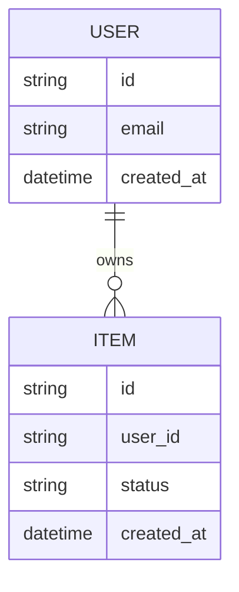

# [프로젝트명] 데이터 모델과 ERD

## 0. 문서 메타데이터

| 항목 | 값 |
| --- | --- |
| 상태 | Draft \| Review \| Active \| Superseded |
| 담당자 | |
| 마지막 업데이트 | |
| 원천 문서 | `docs/prd.md`, `docs/features.md`, `docs/architecture.md` |
| 원천 기능 | `F-001`, `FR-001` |
| 관련 문서 | `docs/backend.md`, `docs/api.md` |

## 1. 목적

구현 전에 필요한 엔티티, 관계, 데이터 소유권, 보존 규칙, 스키마 결정을 정의합니다.

## 2. 데이터 모델링 목표

| 목표 | 중요한 이유 | 우선순위 |
| --- | --- | --- |
| | | |

## 3. 엔티티 목록

| 엔티티 | 목적 | 소유 모듈 | 영속성 | 비고 |
| --- | --- | --- | --- | --- |
| | | | Persistent \| Derived \| Ephemeral | |

## 4. ERD

초기 초안은 Mermaid를 사용합니다. 이후 필요하면 데이터베이스별 스키마로 확장합니다.



### 선택적 DBML

ERD가 너무 크거나 데이터베이스별 세부사항이 중요해지면 DBML을 보조 산출물로 사용합니다.

```dbml
Table users {
  id varchar [pk]
  email varchar [unique, not null]
  created_at timestamp
}

Table items {
  id varchar [pk]
  user_id varchar [not null, ref: > users.id]
  status varchar
  created_at timestamp
}
```

## 5. 엔티티 상세

엔티티마다 이 섹션을 반복합니다.

### [엔티티명]

#### 목적

이 엔티티가 왜 필요한지 설명합니다.

#### 필드

| 필드 | 타입 | 필수 | 고유 | 기본값 | 비고 |
| --- | --- | --- | --- | --- | --- |
| id | | Yes | Yes | | |

#### 관계

| 관련 엔티티 | 관계 | 카디널리티 | 삭제 동작 |
| --- | --- | --- | --- |
| | | 1:1 \| 1:N \| N:M | |

#### 생명주기

| 상태 | 의미 | 생성 주체 | 전이 가능 상태 |
| --- | --- | --- | --- |
| | | | |

#### 검증 규칙

| 규칙 | 적용 대상 | 에러 또는 처리 |
| --- | --- | --- |
| | | |

## 6. 데이터 소유권과 접근

| 데이터 | 소유자 | 읽기 권한 | 쓰기 권한 | 비고 |
| --- | --- | --- | --- | --- |
| | | | | |

## 7. 보존과 삭제

| 데이터 유형 | 보존 기간 | 삭제 트리거 | 삭제 동작 |
| --- | --- | --- | --- |
| | | | |

## 8. 개인정보와 민감도

| 필드 또는 데이터 유형 | 민감도 | 저장 규칙 | 로깅 규칙 |
| --- | --- | --- | --- |
| | Public \| Internal \| Sensitive \| Secret | | |

## 9. 인덱스와 조회 패턴

| 조회 패턴 | 엔티티 | 필드 또는 인덱스 | 이유 |
| --- | --- | --- | --- |
| | | | |

## 10. 마이그레이션 노트

| 변경 | 이유 | 백필 필요 | 리스크 |
| --- | --- | --- | --- |
| | | Yes \| No | |

## 11. 열린 질문

| 질문 | 담당자 | 필요 시점 | 미해결 시 영향 |
| --- | --- | --- | --- |
| | | | |

## 12. 초안 완료 체크리스트

- 핵심 엔티티가 나열되어 있고 기능과 연결되어 있다.
- ERD가 주요 관계를 보여준다.
- 민감 필드와 보존 규칙이 명시되어 있다.
- 소유권과 접근 규칙이 정의되어 있다.
- 중요한 조회를 위한 조회 패턴 또는 인덱스가 기록되어 있다.
