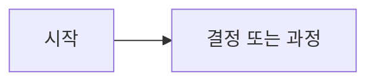

# [문서 제목]

## 목적

이 문서가 왜 필요한지, 누가 읽어야 하는지 설명합니다.

## 상태

- 담당자:
- 마지막 업데이트:
- 상태: Draft | Active | Superseded | Archived
- 관련 문서:

## 요약

가장 짧고 유용한 요약을 작성합니다.

## 상세

본문을 작성합니다. heading 구조를 지키고, 표나 다이어그램은 내용을 더 빠르게 이해하게 만들 때만 사용합니다.

## 시각 자료

문서를 이해하는 데 도움이 될 때만 다이어그램이나 외부 시각 자료 링크를 추가합니다.

## 결정 사항

이 문서에서 확정한 결정을 기록합니다.

## 열린 질문

아직 해결되지 않은 질문을 기록합니다.

## 참고 자료

관련 내부 문서와 외부 출처 링크를 기록합니다.
