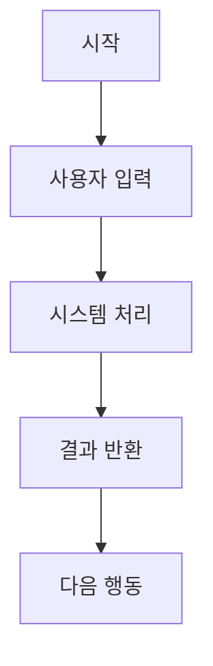
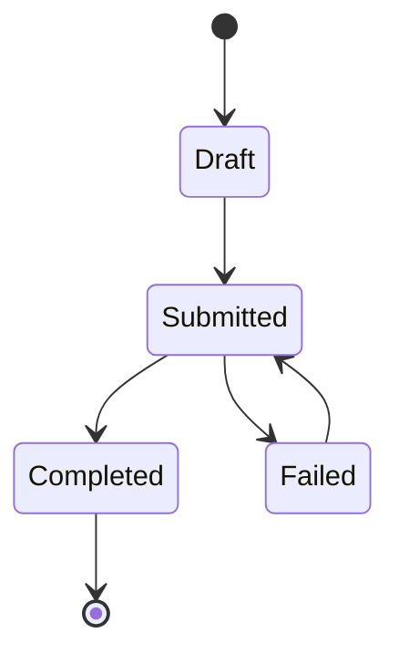

# [프로젝트명] 기능 명세

## 0. 문서 메타데이터

| 항목 | 값 |
| --- | --- |
| 상태 | Draft \| Review \| Active \| Superseded |
| 담당자 | |
| 마지막 업데이트 | |
| 원천 PRD | `docs/prd.md` |
| 관련 문서 | `docs/architecture.md`, `docs/api.md`, `docs/data-model.md` |

## 1. 목적

PRD를 구현 가능한 제품 동작으로 바꾸기 위해 핵심 기능과 기능별 요구사항을 정의합니다.

이 문서는 다음 질문에 답해야 합니다.

- 핵심 기능은 무엇인가?
- 각 기능은 누가 사용하는가?
- 각 기능에는 어떤 입력, 출력, 상태, 규칙이 필요한가?
- 기능이 동작한다고 판단할 인수 조건은 무엇인가?
- 의도적으로 포함하지 않는 것은 무엇인가?

## 2. 기능 목록

| 기능 ID | 기능 | 사용자 또는 행위자 | 우선순위 | 상태 | PRD 근거 |
| --- | --- | --- | --- | --- | --- |
| F-001 | | | P0 \| P1 \| P2 \| Future | Draft | PR-001 |

## 3. 핵심 기능 요약

현재 마일스톤에 필요한 기능만 적습니다.

| 기능 | 사용자 목표 | 제품 결과 | MVP 경계 |
| --- | --- | --- | --- |
| | | | |

## 4. 기능 상세

핵심 기능마다 이 섹션을 반복합니다.

### F-001. [기능명]

#### 목표

이 기능이 만드는 사용자 또는 시스템 결과를 설명합니다.

#### 사용자와 권한

| 행위자 | 할 수 있는 일 | 할 수 없는 일 | 비고 |
| --- | --- | --- | --- |
| | | | |

#### 사용자 흐름

1. 사용자는 다음 위치에서 시작한다:
2. 사용자는 다음 정보를 제공한다:
3. 시스템은 다음을 처리한다:
4. 시스템은 다음 결과를 반환한다:
5. 사용자는 다음 행동을 할 수 있다:



#### 기능 요구사항

| 요구사항 ID | 요구사항 | 우선순위 | 근거 |
| --- | --- | --- | --- |
| FR-001 | | P0 | |

#### 입력

| 입력 | 타입 | 필수 | 검증 | 예시 |
| --- | --- | --- | --- | --- |
| | | Yes \| No | | |

#### 출력

| 출력 | 타입 | 소비자 | 예시 |
| --- | --- | --- | --- |
| | | | |

#### 상태

| 상태 | 의미 | 진입 조건 | 종료 조건 |
| --- | --- | --- | --- |
| | | | |

기능에 의미 있는 생명주기 상태가 있으면 상태 다이어그램을 사용합니다.



#### 비즈니스 규칙

| 규칙 ID | 규칙 | 적용 대상 | 비고 |
| --- | --- | --- | --- |
| BR-001 | | | |

#### 인수 조건

```text
Given [상황]
When [행동]
Then [관찰 가능한 결과]
```

#### 엣지 케이스

| 상황 | 기대 동작 | 사용자 메시지 또는 복구 방법 |
| --- | --- | --- |
| | | |

#### 텔레메트리 또는 감사 이벤트

| 이벤트 | 트리거 | 속성 | 목적 |
| --- | --- | --- | --- |
| | | | |

#### 제외 범위

이 기능이 명시적으로 포함하지 않는 것을 나열합니다.

## 5. 기능 간 의존성

| 의존성 | 영향받는 기능 | 위험 | 필요한 결정 |
| --- | --- | --- | --- |
| | | | |

## 6. 비기능 요구사항

| 범주 | 요구사항 | 적용 기능 | 측정 기준 |
| --- | --- | --- | --- |
| 보안 | | | |
| 개인정보 | | | |
| 성능 | | | |
| 접근성 | | | |
| 신뢰성 | | | |

## 7. 열린 질문

| 질문 | 담당자 | 필요 시점 | 미해결 시 영향 |
| --- | --- | --- | --- |
| | | | |

## 8. 초안 완료 체크리스트

- 핵심 기능에 안정적인 ID가 있다.
- 각 P0 기능에 기능 요구사항이 있다.
- 각 기능의 `PRD 근거`가 하나 이상의 `PR-*` 요구사항을 참조한다.
- 각 P0 기능에 입력, 출력, 상태, 인수 조건이 있다.
- 제외 범위가 명시되어 있다.
- 필요한 기능 의존성이 아키텍처, API, 데이터 모델 문서와 연결되어 있다.
