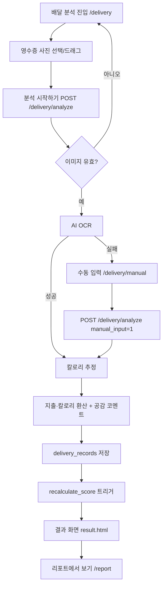
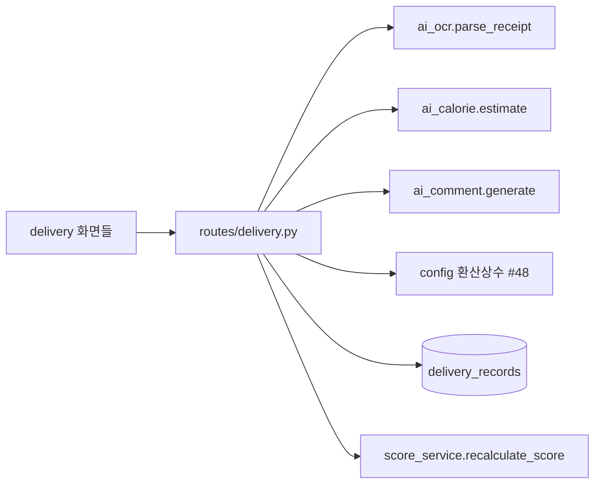

# dopacheck PRD — 배달 분석 (Delivery)

## 0. 문서 메타데이터

| 항목 | 값 |
| --- | --- |
| 상태 | Draft |
| 담당자 | 김관영 (Flask 총괄 · 배달 분석 도메인) |
| 마지막 업데이트 | 2026-06-15 |
| 목표 릴리즈 또는 마일스톤 | MVP (포트폴리오 데모) |
| 원천 후보 | 해당 없음 (기존 프로젝트) |
| 관련 문서 | [`backend.md`](backend.md) · 앱 저장소 `docs/STATUS.md` · `config.py` (#48 환산상수) |

### 변경 이력

| 날짜 | 변경 | 이유 |
| --- | --- | --- |
| 2026-06-15 | 최초 초안 — 배달 분석 도메인 한정 | dopacheck PRD 부재(backend.md만 존재). 김관영 담당 영역(delivery) 우선 작성 |

## 1. 문서 목적

이 PRD는 dopacheck의 **배달 분석(Delivery)** 도메인을 정의한다. 영수증 이미지 한 장에서 주문 내역·금액을 추출하고, 이를 "도파민 소비"의 정량 신호(지출·칼로리)로 환산해 사용자에게 즉시 피드백을 주는 흐름을 다룬다.

- **다루는 범위**: 배달 분석 화면·파이프라인(FR-1~8), 수동 입력 fallback, 환산 규칙, 결과 표현, 도파민 점수와의 연결점.
- **다루지 않는 범위**: 시간 분석(/time), 점수(/score), 리포트(/report), 챌린지(/challenge), 히스토리(/history), 인증·인프라. 각 도메인은 아래 §2.2 소유권 표의 담당자가 별도 문서로 소유한다. 본 문서는 그 경계와 연결 계약만 명시한다.
- **이 문서로 내릴 결정**: 배달 분석의 입력/출력 계약, 환산 규칙의 단일 진실, 실패 상태별 사용자 동작, 점수 모듈로 넘기는 데이터 경계.

## 2. 프로젝트 개요

dopacheck는 "내가 도파민에 얼마를 쓰는가"를 가시화하는 한국어 웹앱이다. 배달 지출과 SNS·앱 사용 시간을 입력받아 **도파민 점수**(0~100)로 환산하고, 추세·비교·챌린지로 행동 변화를 유도한다. Flask 기반 서버 렌더링(SSR) 웹앱이며 모바일 화면을 1차 타깃으로 한다.

배달 분석은 이 제품의 **진입 후크**다. 사용자가 가장 적은 노력(사진 1장)으로 가장 큰 "아하" 순간(이만큼 썼고, 러닝 N분어치 칼로리)을 얻는 지점이기 때문이다.

| 항목 | 값 |
| --- | --- |
| 스택 | Python 3.10 · Flask · PyMySQL(+DBUtils 풀) · Authlib · Gunicorn |
| DB | MariaDB (CloudType) |
| 인증 | Google OAuth 2.0 (Kakao 보류) · Flask 세션 |
| AI | Anthropic API — OCR / 칼로리 추정 / 공감 코멘트 |
| UI | Stitch 디자인 시스템 (`base.html` 토큰 상속, 배달 화면 #53 적용 완료) |

### 2.1 후보에서 승계한 결정

| 구분 | 내용 | 원천 또는 검증 방법 |
| --- | --- | --- |
| 유지할 결정 | 영수증 OCR → 환산 → 코멘트의 3단 파이프라인 | 구현 완료(#35·#41·#53), 통합 테스트 통과 |
| 유지할 결정 | 환산 상수·점수 공식은 `config.py` 단일 진실 | 팀 합의 #48 (지출/칼로리/시간 40·40·20) |
| 다시 검증할 가정 | "사진 1장이면 자동 분석" 정확도가 데모에서 수용 가능한지 | 실제 영수증 표본 OCR 정확도 측정 필요 |
| 의도적으로 변경한 결정 | 업로드 한도 10MB → **5MB** | OOM 방지(#36), 413 핸들러 UX(#43) |

### 2.2 도메인 소유권 (경계 명시)

| 도메인 | 담당 | 본 PRD와의 관계 |
| --- | --- | --- |
| **배달 분석 /delivery** | **김관영** | **본 문서가 정의** |
| 시간 분석 /time | 이은석 | 입력 신호 제공처 — 점수 합산에서 만남 |
| 점수 /score | 김승현 | 배달 결과 저장 후 `recalculate_score` 호출 대상 |
| 리포트 /report | 정재봉 | 배달 환산 결과의 추세·비교 표시처 |
| 챌린지 /challenge + ai | 오영석 | 배달 이력을 추천 입력으로 사용 |
| 히스토리 /history | 허남 | 배달 레코드 열람처 |
| 인증·인프라·DB·Stitch 기준 | 정재봉·김승현 | 공통 토대 |

## 3. 프로젝트 목표

### 3.1 문제 정의

- **사용자가 원하는 결과**: 무심코 쓴 배달 지출을 "체감 가능한 단위"로 즉시 환산해, 소비를 자각하고 싶다.
- **그 결과를 원하는 이유**: 금액 숫자(예: 21,000원)는 추상적이라 행동을 바꾸지 못한다. "치킨 1.2마리값 · 러닝 194분"처럼 환산되면 비로소 와닿는다.
- **현재 상태의 고통/한계**: 가계부 앱은 분류·입력이 번거롭고, 칼로리 앱은 음식만 본다. "지출+칼로리+도파민"을 한 번에 자각시키는 도구가 없다.
- **근거 출처/확신 수준**: Medium — 포트폴리오 가설. 데모 사용자 반응으로 검증 예정.

## 4. 목차

문서 메타데이터 · 문서 목적 · 프로젝트 개요 · 프로젝트 목표 · 타깃 사용자 · 대안과 차별점 · 핵심 가치 제안 · MVP 범위 · 사용자 흐름 · 인터페이스 요구사항 · 시스템 요구사항 · 인수 조건 · 비기능 요구사항 · 엣지 케이스 · 아키텍처 개요 · 데이터 요구사항 · 개인정보·보안 · 성공 지표 · 우선순위 · 가정과 검증 · 주요 리스크 · 열린 질문 · 참고 자료

## 5. 타깃 사용자

### 5.1 주요 사용자
- 배달·SNS 소비가 잦고 "도파민 소비"를 줄이고 싶은 20~30대.

### 5.2 초기 집중 사용자
- 주 2회 이상 배달을 시키고, 영수증/주문 내역을 캡처할 수 있는 모바일 사용자.

### 5.3 비타깃 사용자
- 영수증이 없는 현금·오프라인 결제 위주 사용자, 데스크톱 전용 사용자, 다국어(비한국어) 사용자.

### 5.4 사용자 문제
- 배달비를 포함한 실제 지출 규모를 자각하지 못한다.
- 한 끼 배달의 칼로리 부담을 체감하지 못한다.
- 입력이 번거로우면 기록 자체를 포기한다.

## 6. 대안과 차별점

| 대안 | 한계 | dopacheck 배달 분석의 차이 |
| --- | --- | --- |
| 가계부 앱 | 수동 분류·입력 부담, 칼로리 무시 | 사진 1장 → 금액+칼로리 자동 |
| 칼로리 트래커 | 지출·도파민 맥락 없음 | 지출·칼로리·도파민 점수 동시 환산 |
| 배달앱 주문내역 | 단순 나열, 환산·피드백 없음 | "치킨 N마리값/러닝 N분" 체감 환산 + 공감 코멘트 |

차별 포인트: **입력 마찰 최소화(사진 1장) + 체감 환산 + 도파민 점수 연결**.

## 7. 핵심 가치 제안

> "영수증 한 장이면, 오늘의 배달이 얼마였고 러닝 몇 분어치였는지 바로 보여드려요."

## 8. MVP 범위

| 포함 범위 | 제외 범위 | 이유 |
| --- | --- | --- |
| 영수증 이미지 업로드(JPG/PNG, 5MB) | 영수증 외 결제내역 자동 연동(오픈뱅킹 등) | MVP 마찰·연동 비용 과다 |
| AI OCR → 항목·금액 추출 | 사용자 OCR 결과 인라인 편집 UI | 1차는 수동입력 fallback으로 대체 |
| 지출·칼로리 환산 + 공감 코멘트 | 영양소 분해(탄단지) | 도파민 자각 목적엔 칼로리로 충분 |
| OCR 실패 시 수동 입력 fallback | 항목별 칼로리 수동 보정 | 범위 확장 방지 |
| 결과 저장 + 점수 재산출 트리거 | 배달 레코드 수정/삭제 화면 | 후속 |

### 8.1 포함
- FR-1 업로드, FR-2 OCR, FR-3 칼로리 추정, FR-4 지출 환산, FR-5 칼로리 환산, FR-6 공감 코멘트, FR-7 수동 입력 fallback, FR-8 저장·결과 렌더.

### 8.2 제외
- OCR 결과 인라인 수정, 영수증 외 자동 결제 연동, 영양소 상세, 레코드 편집/삭제.

## 9. 사용자 흐름



## 10. 상호작용 인터페이스 요구사항

| 인터페이스 | 행동 |
| --- | --- |
| `/delivery` (업로드) | 사진 선택·드래그&드롭, 촬영 팁, 분석 시작, 직접 입력 진입, 분석 중 로딩 피드백 |
| `/delivery/manual` (수동입력) | 음식명/가격/수량 행 추가·삭제, 합계 자동 계산, 배달비 입력, 제출 |
| `/delivery/analyze` (POST) | 업로드/수동 입력을 받아 파이프라인 실행, 결과 또는 실패 리다이렉트 |
| 결과(`result.html`) | 지출·칼로리·공감 코멘트·주문 내역 표시, 리포트/재분석 이동 |

알림·운영 인터페이스: 해당 없음 (MVP는 화면 내 flash 메시지로 충분).

## 11. 제품 또는 시스템 요구사항

| 요구사항 ID | 요구사항 | 시나리오 | 우선순위 | 비고 |
| --- | --- | --- | --- | --- |
| FR-1 | JPG/PNG 영수증 업로드만 허용, 최대 5MB | 사용자가 사진을 올린다 | P0 | 비허용 형식·초과는 §14 |
| FR-2 | 업로드 이미지를 AI OCR로 항목·수량·가격·배달비·총액 추출 | 영수증 인식 | P0 | `ai_ocr.parse_receipt` |
| FR-3 | 추출 항목의 칼로리(kcal) 추정 | 항목별 kcal·총 kcal 산출 | P0 | `ai_calorie.estimate` |
| FR-4 | 총 지출을 체감 단위로 환산(치킨 마리수, 헬스장 개월) | 21,000원 → 치킨 1.2마리·헬스장 0.4개월 | P0 | `config` 상수 #48, 음수는 0 클램핑 |
| FR-5 | 총 칼로리를 운동량으로 환산(러닝 분, 걷기 시간) | 1,940kcal → 러닝 194분·걷기 7.8시간 | P0 | `config` 상수 #48, 음수는 0 클램핑 |
| FR-6 | 결과에 대한 공감 코멘트 1개 생성 | 따뜻한 한국어 한 줄 | P1 | `ai_comment.generate`, 실패 시 코멘트 생략 |
| FR-7 | OCR 실패 시 수동 입력 폼으로 fallback | 인식 실패 → 직접 입력 | P0 | `manual_input=1` 경로 |
| FR-8 | 결과를 `delivery_records`에 저장하고 점수 재산출을 트리거 | 저장 후 점수 갱신 | P0 | `score_service.recalculate_score` |

서버 계약 (`POST /delivery/analyze`):
- 공통: `csrf_token` 필수.
- 이미지 경로: `image`(multipart, JPG/PNG, ≤5MB).
- 수동 경로: `manual_input=1`, `food_names`(쉼표 구분), `total_price`(정수), `delivery_fee`(정수, 기본 0).
- 음식명 길이 상한 100자 (#41).

## 12. 인수 조건

```text
Given 로그인한 사용자가 유효한 JPG 영수증(≤5MB)과 csrf_token을 제출하면
When OCR·칼로리·환산·코멘트 파이프라인이 성공하고
Then 결과 화면에 총 지출·총 칼로리·환산 레이블·주문 내역이 표시되고 delivery_records에 1건 저장된다
```

```text
Given OCR 단계에서 예외가 발생하면
When /delivery/analyze 가 이를 감지하면
Then 사용자는 /delivery/manual 로 리다이렉트되어 직접 입력을 이어갈 수 있다
```

```text
Given 업로드 파일이 5MB를 초과하면
When 요청이 MAX_CONTENT_LENGTH를 넘기면
Then 413 핸들러가 "파일 크기가 5MB를 초과했습니다" flash 후 /delivery 로 리다이렉트한다
```

```text
Given csrf_token 이 없거나 불일치하면
When 분석 POST가 들어오면
Then 403으로 차단한다
```

## 13. 비기능 요구사항

| 범주 | 요구사항 | 측정 기준 | 우선순위 |
| --- | --- | --- | --- |
| 보안 | 분석 POST는 CSRF 토큰 검증 | 토큰 불일치 시 403 | P0 |
| 보안 | 업로드 크기 상한 | 5MB 초과 413 | P0 |
| 개인정보 | 영수증 이미지는 분석에만 사용, 원본 장기 보관 최소화 | 저장 정책 §18 | P1 |
| 성능 | 분석 1건 응답 | 데모 환경 P95 ≤ 10초(AI 호출 포함) | P1 |
| 신뢰성 | AI 단계 실패가 사용자 흐름을 끊지 않음 | OCR 실패→수동, 코멘트 실패→생략 | P0 |
| 접근성 | 파일 입력 accept·필수 표시, 빈 제출 가드 | 키보드/스크린리더 라벨 | P2 |

## 14. 엣지 케이스와 에러 처리

| 상황 | 기대 동작 | 사용자 메시지 / 복구 | 우선순위 |
| --- | --- | --- | --- |
| 권한 없음(미로그인) | `login_required` 차단 | 로그인 화면으로 | P0 |
| 이미지 누락 | 분석 거부 | /delivery 로 리다이렉트 + 안내 | P0 |
| 비허용 형식(gif 등) | 분석 거부 | /delivery 로 리다이렉트 | P0 |
| 5MB 초과 | 413 핸들러 | flash 후 /delivery | P0 |
| OCR 실패 | 수동 입력 fallback | /delivery/manual | P0 |
| 칼로리/코멘트 AI 실패 | 부분 결과 표시 | 코멘트 생략, 환산은 진행 | P1 |
| 음수/이상 금액 | 0으로 클램핑 | 환산 0 표시 | P1 |
| CSRF 누락 | 차단 | 403 | P0 |
| DB 저장 실패 | 사용자 흐름 보호 | 오류 안내 + 재시도 유도 | P1 |

## 15. 아키텍처 개요



상세 구현(라우트 패턴·DB 접근 규약·세션 키)은 [`backend.md`](backend.md)에 둔다. 데이터 모델·API 스키마는 필요 시 `docs/data-model.md`·`docs/api.md`로 분리한다(현재 미작성).

## 16. 프로토타입 범위

- **증명할 것**: 사진 1장 → 환산 결과까지의 마찰 없는 흐름과 "아하" 체감.
- **시도하지 않을 것**: OCR 정확도 자체의 고도화, 영수증 외 자동 연동, 영양소 분해.

## 17. 데이터 요구사항

핵심 엔티티: `delivery_records`(user_id, 총 지출, 배달비, 총 kcal, 항목 목록, created_at). 모든 조회는 앱 레벨 `WHERE user_id = %s` 로 스코프한다(RLS 없음). 필드·인덱스·조회 패턴 상세는 `docs/data-model.md`(미작성)로 분리 예정.

## 18. 개인정보와 보안 요구사항

- 영수증 이미지는 분석 파이프라인 입력으로만 사용하고, 결과(추출 텍스트·환산값) 위주로 저장한다. 원본 이미지 장기 보관은 최소화한다.
- 모든 배달 데이터는 사용자 단위로 격리(`user_id` 필터).
- 외부 AI 호출 시 영수증 텍스트가 전송됨을 인지하고, 민감 식별정보는 보관·로깅하지 않는다.
- 세션·CSRF·업로드 한도는 §13 보안 항목을 따른다.

## 19. 성공 지표

- (정량) 업로드→결과 도달률 ≥ 80% (실패·이탈 제외).
- (정량) OCR 1차 성공률(수동 fallback 없이 완주) 목표 ≥ 60% (데모 표본).
- (정량) 분석 P95 응답 ≤ 10초.
- (정성) 데모 사용자가 환산 결과에서 "체감된다"는 반응을 보임.

## 20. 우선순위

> dopacheck는 FR-ID + P0/P1/P2 체계를 사용한다(STATUS.md와 일치).

### P0
- FR-1, FR-2, FR-3, FR-4, FR-5, FR-7, FR-8 + CSRF/5MB/413 가드.

### P1
- FR-6 공감 코멘트, 음수 클램핑, 성능·신뢰성 목표.

### P2
- 접근성 보강, OCR 결과 인라인 편집(범위 외→후속).

### Future
- 영수증 외 결제 자동 연동, 영양소 분해, 레코드 편집/삭제 화면.

## 21. 가정과 검증

| 가정 | 근거 수준 | 틀렸을 때의 위험 | 담당자 | 검증 계획 |
| --- | --- | --- | --- | --- |
| 사용자가 영수증/주문내역을 캡처할 수 있다 | Medium | 진입 자체가 막힘 | 김관영 | 데모 사용자 인터뷰 |
| AI OCR 정확도가 데모 수용 수준 | Medium | 수동 입력 의존도 급증 | 김관영 | 실제 영수증 표본 정확도 측정 |
| 환산 단위가 "체감"을 유도한다 | Medium | 핵심 가치 미달 | 김관영 | 결과 화면 반응 관찰 |
| 5MB 한도가 실사용 사진을 커버 | High | 정상 업로드 차단 | 김관영 | 모바일 카메라 표본 용량 확인 |

## 22. 주요 리스크

- **AI 비용/지연**: OCR·칼로리·코멘트 다단 호출의 비용·지연. 완화: 단순 작업 모델 경량화(#56), 실패 시 부분 결과.
- **OCR 품질 편차**: 영수증 포맷 다양성. 완화: 수동 입력 fallback(FR-7), 촬영 팁.
- **점수 정합성**: 배달 저장 후 점수 재산출 누락 시 경로별 stale(타 도메인 #75와 동일 계열). 완화: 저장 직후 `recalculate_score` 트리거 보장.
- **개인정보**: 영수증의 부수 정보(주소/연락처) 노출 가능성. 완화: 저장 최소화·로깅 금지.

## 23. 회고

(프로토타입/마일스톤 이후 작성)

## 24. 열린 질문

- 영수증 원본 이미지를 저장할 것인가, 추출 결과만 저장할 것인가? (개인정보 vs 재분석 편의)
- OCR 결과 인라인 편집을 MVP 직후 도입할지?
- 배달 환산 상수(치킨/헬스장 가격)를 지역·시점에 따라 갱신하는 정책이 필요한가?
- 수동 입력의 수량(quantity)을 칼로리 추정에 반영할지(현재 음식명 기준)?

## 25. 참고 자료

- 앱 저장소 `docs/STATUS.md` — 도메인 소유권·머지 이력·알려진 이슈.
- `config.py` — 환산 상수·점수 공식 단일 진실 (#48).
- [`backend.md`](backend.md) — Flask 구현 가이드(공통 패턴).
- 관련 이슈: #35·#41·#53(배달 구현/CSRF/Stitch), #36·#43(업로드 한도·413), #56(AI 비용 최적화).
