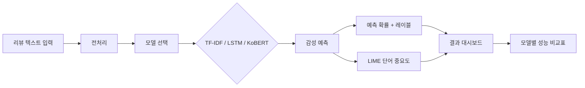
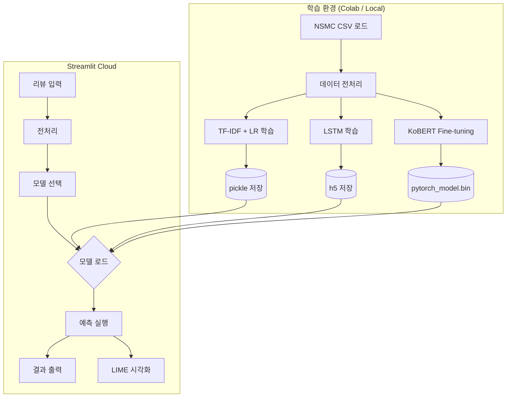

# review-sentiment PRD

## 0. 문서 메타데이터

| 항목 | 값 |
| --- | --- |
| 상태 | Draft |
| 담당자 | 김관영 |
| 마지막 업데이트 | 2026-06-18 |
| 목표 릴리즈 또는 마일스톤 | 2026-06-24 (머신러닝 과제 발표) |
| 원천 후보 | `../../_workspace-docs/topic-brainstorming.md` T-025 |
| 관련 문서 | — |

### 변경 이력

| 날짜 | 변경 | 이유 |
| --- | --- | --- |
| 2026-06-18 | 최초 초안 | |

## 1. 문서 목적

이 PRD는 review-sentiment 프로젝트의 제품 요구사항과 의사결정 기준을 정의한다.

- **다루는 범위**: NSMC 데이터 기반 감성 분류 모델 개발, Streamlit 데모 앱, 모델 비교 평가, LIME 기반 예측 근거 시각화.
- **다루지 않는 범위**: 실시간 수집 파이프라인, 사용자 계정/인증, 모델 재학습 자동화, 모바일 앱, 장르 레이블 수집(NSMC에 장르 정보 없음).
- **이 문서로 내릴 결정**: 데이터셋 선정, 모델 후보와 평가 기준, MVP 시연 범위, 포트폴리오 연결 전략, 토크나이저 선택, 모델 해석 도구 선택.

## 2. 프로젝트 개요

NSMC(Naver Sentiment Movie Corpus) 20만 건의 영화 리뷰로 긍/부정 감성 분류 모델을 학습하고, Streamlit 대시보드에서 사용자 입력 리뷰의 감성을 예측하며 LIME으로 예측 근거 단어를 시각화하는 ML 프로젝트다. TF-IDF + LogisticRegression, LSTM, KoBERT 3개 모델을 비교하여 성능 차이를 수치로 보여준다.

| 항목 | 값 |
| --- | --- |
| 스택 | Python 3.10 · scikit-learn · TensorFlow/Keras · Transformers · Streamlit |
| 데이터 | NSMC(Kaggle) — 200,000 reviews, 긍/부정 레이블 |
| 배포 | Streamlit Cloud (share.streamlit.io) |
| 모델 해석 | LIME (LimeTextExplainer) |

### 2.1 후보에서 승계한 결정

| 구분 | 내용 | 원천 또는 검증 방법 |
| --- | --- | --- |
| 유지할 결정 | NSMC 데이터셋 사용 | Kaggle 공개 데이터, 즉시 다운로드 가능 |
| 유지할 결정 | Streamlit Cloud 배포 | 과제 요구사항, 무료 |
| 유지할 결정 | 3개 모델(TF-IDF/LSTM/KoBERT) 비교 | 다양한 ML 스펙트럼 커버 |
| 다시 검증할 가정 | KoBERT를 로컬에서 학습 가능한가 | Colab 또는 CPU fallback 확인 필요 |
| 의도적으로 변경한 결정 | Mooditree UI 프로젝트 → review-sentiment ML 프로젝트 | 기존 포트폴리오의 ML 부재를 보완 |

## 3. 프로젝트 목표

### 3.1 문제 정의

- **사용자가 원하는 결과**: 한국어 영화 리뷰 텍스트를 입력하면 긍/부정 감성을 정확히 예측하고, 예측 근거를 이해할 수 있어야 한다.
- **그 결과를 원하는 이유**: ML 과제 제출과 포트폴리오 완성도 향상. 기존 Mooditree는 감정 도메인을 다뤘지만 ML 모델이 없어 "AI 프로젝트"라는 이름에 비해 기술적 깊이가 부족했다.
- **현재 상태의 고통 또는 한계**: Mooditree는 React + Zustand로 감정 입력 UI만 구현. 실제 텍스트 감정 분석 모델, 추천 알고리즘, 모델 평가 및 배포 경험이 포트폴리오에서 빠져 있음.
- **근거 출처 또는 확신 수준**: High — NSMC는 한국어 NLP 벤치마크 데이터로 검증된 데이터셋.

## 4. 목차

문서 메타데이터 · 문서 목적 · 프로젝트 개요 · 프로젝트 목표 · 타깃 사용자 · 대안과 차별점 · 핵심 가치 제안 · MVP 범위 · 사용자 흐름 · 상호작용 인터페이스 요구사항 · 제품 또는 시스템 요구사항 · 인수 조건 · 비기능 요구사항 · 엣지 케이스와 에러 처리 · 아키텍처 개요 · 프로토타입 범위 · 데이터 요구사항 · 개인정보와 보안 요구사항 · 성공 지표 · 우선순위 · 가정과 검증 · 주요 리스크 · 회고 · 열린 질문 · 참고 자료

## 5. 타깃 사용자

### 5.1 주요 사용자

- 머신러닝 수업을 수강하고 과제를 제출해야 하는 학습자(본인).
- 채용 담당자 또는 포트폴리오 평가자.

### 5.2 초기 집중 사용자

- 발표 당일 시연을 지켜보는 교수자 및 동료 수강생.
- Streamlit 링크로 직접 리뷰를 입력해보는 청중.

### 5.3 비타깃 사용자

- 실시간 서비스가 필요한 일반 대중. 이 프로젝트는 학습 과제 제출이 1차 목적이다.

### 5.4 사용자 문제

- 한국어 텍스트 감성 분류 모델을 엔드투엔드로 구현하고 비교한 경험이 부족하다.
- 모델 예측 결과를 "왜 그렇게 예측했는지" 시각적으로 설명할 방법이 필요하다.
- 기존 포트폴리오의 "AI 프로젝트"라는 명칭에 비해 ML 구현체가 빈약하다.

## 6. 대안과 차별점

| 대안 | 한계 | review-sentiment의 차이 |
| --- | --- | --- |
| Kaggle Notebook 제출 | 외부에서 접근 불가, 인터랙션 부족 | Streamlit으로 누구나 리뷰 입력 가능 |
| 단일 모델만 구현 | 모델 선정 근거 부족 | TF-IDF/LSTM/KoBERT 3종 비교 + 성능표 |
| 기존 Mooditree UI | ML 모델 없음, "AI 프로젝트" 이름만 있음 | 실제 KoBERT/LSTM 모델로 감정 분석 + 시각화 |
| 예측 결과만 출력 | 블랙박스 | LIME으로 근거 단어 하이라이트 |

차별 포인트: **3개 모델 비교 + 예측 근거 시각화 + 기존 포트폴리오와 연결된 발전 스토리**.

## 7. 핵심 가치 제안

한국어 영화 리뷰 한 줄을 입력하면 "이 리뷰는 92% 확률로 긍정입니다"라는 예측과 함께 예측에 가장 큰 영향을 준 단어 5개를 LIME으로 시각적으로 보여준다. TF-IDF → LSTM → KoBERT로 갈수록 성능이 어떻게 달라지는지 한 화면에서 비교할 수 있다.

## 8. MVP 범위

| 포함 범위 | 제외 범위 | 이유 |
| --- | --- | --- |
| NSMC 데이터 전처리 및 EDA | 실시간 크롤링 | 과제 범위 초과, 데이터 안정성 확보 |
| TF-IDF + LogisticRegression 모델 | 앙상블 모델 | 3종 비교로 충분,复杂度 대비 효율 |
| LSTM 모델 | Transformer 단독 | KoBERT가 트랜스포머 기반으로 커버 |
| KoBERT 모델 | LoRA/fine-tuning 가속 | 풀 파인튜닝으로 충분 |
| LIME 시각화 | Grad-CAM 등 다른 해석 기법 | LIME 1개로 충분, KoBERT에도 적용 가능 |
| Streamlit 단일 페이지 | 다중 페이지 대시보드 | MVP 단순성 유지 |
| 긍/부정 이진 분류 | 다중 감정 분류(기쁨/슬픔 등) | NSMC는 이진 레이블, 과제 기간 내 현실적 |

### 8.1 포함

1. NSMC 데이터 로드 및 전처리 (Okt 형태소 분석, 불용어 제거, 패딩)
2. EDA: 리뷰 길이 분포, 워드클라우드, 레이블 분포
3. TF-IDF + LogisticRegression 학습 및 평가
4. LSTM (Embedding + LSTM + Dense) 학습 및 평가
5. KoBERT fine-tuning 및 평가
6. 모델 성능 비교표 (Accuracy, Precision, Recall, F1)
7. LIME(LimeTextExplainer)을 활용한 예측 근거 단어 시각화
8. Streamlit 앱: 리뷰 입력 → 모델 선택 → 예측 결과 + 근거 단어 출력

### 8.2 제외

1. 사용자 계정/로그인
2. 리뷰 데이터 수집 자동화
3. 모델 재학습/자동 업데이트
4. 다국어 지원
5. 모바일 앱
6. 실시간 추천 시스템
7. 다중 감정 레이블 분류

## 9. 사용자 흐름



1. 사용자가 Streamlit 페이지에 접속한다.
2. 텍스트 영역에 영화 리뷰를 입력한다.
3. 분석할 모델(TF-IDF / LSTM / KoBERT / 모두 비교)을 선택한다.
4. 시스템이 입력 텍스트를 전처리하고 선택한 모델로 예측한다.
5. 예측 결과(긍정/부정, 확률)를 출력한다.
6. 예측에 가장 큰 영향을 준 단어 TOP 5~10을 하이라이트하여 표시한다.
7. 하단에 3개 모델의 성능 비교표를 확인할 수 있다.

## 10. 상호작용 인터페이스 요구사항

### 10.1 Streamlit 웹 인터페이스

| 요소 | 설명 |
| --- | --- |
| 리뷰 입력 | `st.text_area` — 1~3문장 영화 리뷰 |
| 모델 선택 | `st.radio` 또는 `st.selectbox` — TF-IDF / LSTM / KoBERT / 모두 |
| 예측 결과 | `st.metric` — 긍정/부정 레이블 + 신뢰도 확률 |
| 근거 단어 | `st.bar_chart` 또는 커스텀 시각화 — 단어별 기여도 |
| 성능 비교표 | `st.dataframe` — 모델별 Accuracy/Precision/Recall/F1 |

## 11. 제품 또는 시스템 요구사항

| 요구사항 ID | 요구사항 | 사용자 이야기 또는 시나리오 | 우선순위 | 비고 |
| --- | --- | --- | --- | --- |
| PR-001 | NSMC 데이터를 로드하고 학습/테스트 세트를 분리한다. | "데이터를 8:2로 나눠 학습한다" | P0 | |
| PR-002 | 한국어 형태소 분석으로 텍스트를 전처리한다. | "OKT 또는 Mecab으로 토크나이징한다" | P0 | Colab 환경 고려 |
| PR-003 | TF-IDF + LogisticRegression 모델을 학습하고 저장한다. | "pickle로 모델 저장, Streamlit에서 로드" | P0 | |
| PR-004 | LSTM 모델을 학습하고 `.h5`로 저장한다. | "Embedding → LSTM → Dense 구조" | P0 | Colab 학습 후 저장 |
| PR-005 | KoBERT를 fine-tuning하고 저장한다. | "transformers 라이브러리 활용" | P0 | GPU 필수, Colab 권장 |
| PR-006 | 각 모델의 Accuracy/Precision/Recall/F1을 계산한다. | "classification_report로 출력" | P0 | |
| PR-007 | Streamlit 앱에서 모델을 로드하고 예측을 수행한다. | "pickle/h5/torch로 로드 → predict" | P0 | |
| PR-008 | LIME으로 예측 근거 단어를 시각화한다. | "LimeTextExplainer로 예측에 기여한 단어 TOP 5 표시" | P1 | |
| PR-009 | 3개 모델 성능을 하나의 비교표로 보여준다. | "st.dataframe으로 출력" | P1 | |
| PR-010 | EDA 결과(워드클라우드, 길이 분포 등)를 앱에 포함한다. | "데이터 탐색 결과 시각화" | P2 | |

## 12. 인수 조건

### PR-003: TF-IDF + LogisticRegression

```text
Given NSMC 학습 데이터
When TF-IDF 벡터라이저를 fit하고 LogisticRegression을 학습시킨 후
Then 테스트 Accuracy가 0.80 이상이어야 한다
```

### PR-004: LSTM

```text
Given 전처리된 NSMC 학습 데이터
When Embedding → LSTM → Dense 구조로 학습시킨 후
Then 테스트 Accuracy가 0.85 이상이어야 한다
```

### PR-005: KoBERT

```text
Given NSMC 학습 데이터
When KoBERT를 fine-tuning한 후
Then 테스트 Accuracy가 0.88 이상이어야 한다
```

### PR-007: Streamlit 예측

```text
Given Streamlit 앱이 실행 중인 상태
When 사용자가 "정말 재미있는 영화였어요"를 입력하고 예측 버튼을 누르면
Then "긍정" 레이블과 0.8 이상의 확률이 출력되어야 한다
```

## 13. 비기능 요구사항

| 범주 | 요구사항 | 측정 기준 또는 표준 | 우선순위 |
| --- | --- | --- | --- |
| 성능 | TF-IDF 모델 예측이 1초 이내에 완료되어야 함 | `time` 측정 | P0 |
| 성능 | KoBERT 모델 예측이 5초 이내에 완료되어야 함 | `time` 측정 | P1 |
| 신뢰성 | 동일 입력에 대해 동일 예측 결과를 반환해야 함 | 시드 고정 | P1 |
| 저장 | 모델 파일 크기가 Streamlit Cloud 무료 티어 제한을 초과하지 않아야 함 | GitHub 100MB | P1 |

## 14. 엣지 케이스와 에러 처리

| 상황 | 기대 동작 | 사용자 메시지 또는 복구 방법 | 우선순위 |
| --- | --- | --- | --- |
| 빈 리뷰 입력 | 예측 실행 차단 | "리뷰 텍스트를 입력해주세요." | P0 |
| 너무 짧은 리뷰(1~2글자) | 예측은 수행하나 신뢰도 낮음 표시 | "입력이 짧아 예측 신뢰도가 낮을 수 있습니다." | P1 |
| 모델 파일 로드 실패 | fallback 메시지와 함께 다른 모델 사용 유도 | "KoBERT 모델을 불러올 수 없습니다. TF-IDF 모델을 사용해보세요." | P0 |
| Streamlit Cloud 메모리 부족 | KoBERT 모델 로드 생략 | "KoBERT는 로컬 또는 Colab에서만 지원됩니다." | P1 |
| 특수문자/이모지만 입력 | 전처리 후 빈 텍스트 처리 | "분석 가능한 텍스트가 없습니다. 한글 리뷰를 입력해주세요." | P1 |

## 15. 아키텍처 개요



## 16. 프로토타입 범위

프로토타입은 다음을 증명해야 한다:

- 서로 다른 복잡도의 모델(TF-IDF → LSTM → KoBERT) 간 성능 차이를 수치로 비교 가능하다.
- 모델 예측 결과를 단어 단위로 해석하여 사용자에게 설명할 수 있다.
- Streamlit Cloud에서 모델 파일을 로드하고 실시간 예측이 동작한다.

프로토타입에서 시도하지 않을 것:

- 사용자 세션 관리, 데이터 영속성, A/B 테스트.

## 17. 데이터 요구사항

### 17.1 NSMC (Naver Sentiment Movie Corpus)

| 항목 | 값 |
| --- | --- |
| 출처 | https://github.com/e9t/nsmc — `ratings_train.txt` / `ratings_test.txt` |
| 크기 | 200,000개 리뷰 (train 150,000 / test 50,000) |
| 포맷 | Tab-separated `.txt` (id / document / label) |
| 레이블 | 0 (부정), 1 (긍정) |
| 라이선스 | CC0 1.0 Universal |
| 확인 | 2026-06-18 접속 확인, raw 파일 정상 응답 |

### 17.2 전처리 결과물

| 항목 | 형식 | 비고 |
| --- | --- | --- |
| TF-IDF 벡터라이저 | `.pkl` | vocab size 10,000 |
| TF-IDF + LR 모델 | `.pkl` | |
| LSTM 토크나이저 | `.pkl` | |
| LSTM 모델 | `.h5` | vocab size 20,000, embedding 100, lstm 128 |
| KoBERT 모델 | `pytorch_model.bin` | klue/bert-base (full fine-tune) |

## 18. 개인정보와 보안 요구사항

- NSMC는 공개 데이터셋으로 개인정보를 포함하지 않는다.
- Streamlit 앱에서 입력받는 리뷰 텍스트는 서버에 저장되지 않는다 (세션 휘발).
- 모델 파일은 GitHub LFS 또는 Git Annex로 관리하며, `.gitignore`로 대용량 파일의 일반 커밋을 방지한다.
- API 키, 토큰 등 민감 정보는 `.env` 또는 `st.secrets`로 관리한다.

## 19. 성공 지표

| 지표 | 목표 | 측정 방법 |
| --- | --- | --- |
| KoBERT 테스트 Accuracy | 0.88 이상 | `sklearn.metrics.accuracy_score` |
| TF-IDF vs LSTM vs KoBERT 성능 차이 | 단계적 향상 확인 가능 | 비교표 출력 |
| Streamlit 예측 응답 시간 | 5초 이내 | 발표 시 실측 |
| 발표 피드백 | 모델 비교와 시각화에 대한 긍정 평가 | 발표 후 Q&A |

## 20. 우선순위

### P0

반드시 출시: NSMC 데이터 전처리, TF-IDF + LogisticRegression, Streamlit 기본 앱, 예측 결과 출력, 모델 성능 비교표.

### P1

다음으로 중요: LSTM 모델, KoBERT 모델, LIME 시각화.

### P2

유용한 개선: EDA 시각화 포함, 워드클라우드, 다양한 예시 리뷰 프리셋.

### Future

장기 확장: 다중 감정 분류(7-class), 실시간 리뷰 크롤링, 추천 시스템 연동, Mooditree 앱과 직접 연동.

## 21. 가정과 검증

| 가정 | 근거 수준 | 틀렸을 때의 위험 | 담당자 | 검증 계획 |
| --- | --- | --- | --- | --- |
| KoBERT를 Google Colab에서 fine-tuning 가능 | Medium | Colab GPU 메모리 부족 시 CPU fallback 또는 LSTM만 데모 | 김관영 | Colab GPU 확인 후 대체 계획 수립 |
| Streamlit Cloud 무료 티어로 모델 3개 로드 가능 | Medium | 메모리 초과로 KoBERT 로드 실패 가능 | 김관영 | 모델 경량화 또는 조건부 로드 구현 |
| 발표 청중이 모델 비교표를 이해 | High | 표가 너무 복잡하면 전달력 하락 | 김관영 | 시각적 계층 구성으로 가독성 확보 |

## 22. 주요 리스크

| 리스크 | 영향 | 확률 | 대응 |
| --- | --- | --- | --- |
| KoBERT 학습에 GPU 시간 부족 | KoBERT 누락, 2개 모델만 비교 | 중 | Colab Pro trial 또는 CPU 경량 모델 fallback |
| 모델 파일이 GitHub 100MB 초과 | Streamlit Cloud 배포 실패 | 중 | Git LFS 또는 모델 경량화, 필요시 Colab 링크 별도 제공 |
| Streamlit Cloud에서 KoBERT OOM | 모델 3개 동시 로드 불가 | 중 | 조건부 로드: 사용자가 선택한 모델만 HuggingFace Hub에서 로드, `st.cache_resource`로 캐싱 |
| 발표 당일 네트워크 장애 | 시연 불가 | 저 | 로컬 Streamlit fallback + ngrok 준비 |

## 23. 회고

(프로젝트 완료 후 작성)

## 24. 열린 질문

1. KoBERT를 CPU-only 환경에서 어느 정도까지 최적화할 수 있을까? → ONNX 변환 또는 양자화 검토 필요.
2. Streamlit Cloud에서 Hugging Face Hub 모델 다운로드 시간이 수용 가능한가? → 첫 로드 시 1~2분, 이후 `st.cache_resource`로 즉시 제공 예정. 발표 당일 사전 웜업 필요.
3. 과제 제출용 hwp 보고서 양식(교재 폴더의 "머신러닝 산출물_20250312(홍길동v0.1).hwp")을 확인했는가? → 다른 PC에서 확인 예정.

## 25. 참고 자료

- NSMC GitHub 저장소: https://github.com/e9t/nsmc (raw 파일 정상, 2026-06-18 확인)
- KoBERT Hugging Face: https://huggingface.co/skt/kobert-base-v1 (safetensors 배포, 92.2M params)
- KoBERT NSMC Fine-tuning Colab: https://colab.research.google.com/github/SKTBrain/KoBERT/blob/master/scripts/NSMC/naver_review_classifications_pytorch_kobert.ipynb (공식, 정상 동작 확인)
- LIME: https://github.com/marcotcr/lime
- konlpy (Okt 토크나이저): https://github.com/konlpy/konlpy
- Streamlit: https://streamlit.io
- Mooditree portfolio: `_workspace-docs/topic-brainstorming.md` T-025 연결 참조
